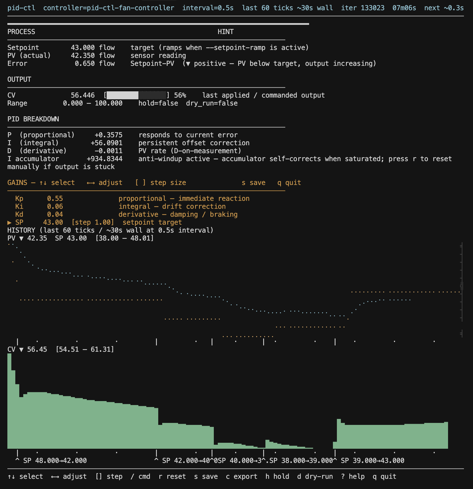

# pid-ctl



Many automation tasks are feedback loops: read a measurement from a sensor, a file, or a small script; compare it to a target; adjust an output you control (heater duty, fan speed, valve position, PWM); repeat on a schedule or whenever new data arrives. **pid-ctl** implements the middle step—the control law—so you can wire **measurement → decision → output** into scripts, `cron`, `systemd`, and shell pipelines instead of a separate GUI or proprietary runtime.

The project ships as a CLI and a small Rust library. You configure a target, where to read the current value, and where to send the next control value, using files, subprocesses, standard I/O, or an optional simulator for dry runs. A **PID** controller is used under the hood: it combines proportional, integral, and derivative terms to decide how strongly to push the output so the measurement tracks the target. Gains, limits, and safety-related options are exposed as flags; a terminal dashboard is available for live tuning on `loop`.

Below, **PV** (*process variable*) means the measured value you read, and **CV** (*control variable*) means the value you send to the actuator—standard names in process control. The repository is a Rust workspace with three crates (core math, CLI, simulator). The sections below describe how to use the CLI end-to-end; `pid-ctl --help` and `pid-ctl <command> --help` list every flag.

## Features

### Control core (`pid-ctl-core`)

- **Position-form PID** with **derivative on measurement** (reduces setpoint kick).
- **Output limits**, optional **CV slew-rate limiting**, and **setpoint ramping**.
- **PV low-pass filter** (configurable α), **error deadband**, and **anti-windup** (`back-calc`, `clamp`, or `none`) with optional back-calculation tracking time.
- **Pure, testable math**—no I/O inside the core; configuration is validated before stepping.

### CLI (`pid-ctl`)

- **`once`** — Run a **single** PID tick for scripting and tests (literal PV, file, or command-sourced PV; CV to stdout, file, or command).
- **`pipe`** — Read PV lines from **stdin**, write CV lines to **stdout** (composable in shell pipelines). Each line's time step is the wall-clock elapsed time since the previous line, so the PID math scales correctly to irregular or fast/slow streams. The very first line has no predecessor, so its time step defaults to 1 second (override with `--dt`).
- **`loop`** — Periodic **control loop** with a wall-clock **interval**, PV from **file**, **command**, or **stdin** (one line per tick, with optional timeout).
- **`status`** — Inspect persisted controller state and/or query a running **`loop`** over a **Unix domain socket** (see below).
- **State file** — Optional JSON **persistence** (`--state`) with `init` / `purge`, configurable flush interval, and failure policies for disk writes.
- **Structured logging** — **NDJSON** events on stderr and/or `--log` (ISO8601 timestamps, schema version). Human-readable **text** or **JSON** summaries where applicable.
- **`--tune` (TUI)** — Interactive tuning dashboard (requires the default `tui` feature and a TTY): adjust gains, setpoint, and related options while the loop runs. The PV panel renders both the PV and SP traces as a Braille-dot canvas overlay so step changes in setpoint are visible alongside the measured response. A scale ruler on the right edge of the PV canvas uses tick characters (`·` sub-step, `╴` half-step, `┤` base step, `╡` major step, `╣` decade) anchored to the setpoint's natural scale so ticks remain stable across zoom levels. A minimum-zoom floor prevents the graph from collapsing to a dot when PV has fully converged. The CV panel uses a sparkline.
- **Unix-only: control socket** — While `loop` runs with `--socket`, use **`set`**, **`hold`**, **`resume`**, **`reset`**, and **`save`** to change parameters or coordinate shutdown without restarting the process.

### Simulator (`pid-ctl-sim`)

- **First-order**, **thermal**, and **fan** plant models with JSON state on disk.
- **`print-pv`** / **`apply-cv`** commands align with `pid-ctl loop --pv-cmd` / `--cv-cmd` for **closed-loop** experiments and **`loop --tune`**.

## Design & opinions

This project is built for **operators and automation** who already live in shells, systemd, and ad hoc scripts—not as a replacement for a full PLC/SCADA stack. The shape of the tool follows from that.

**Unix composition over embedded UI.** The primary interface is a CLI that fits pipes, `cron`, and one-shot scripts. Long-running control uses **`loop`**; streaming or externally paced workloads use **`pipe`**; idempotent “tick and exit” jobs use **`once`**. We split those deliberately: mixing them would blur who owns timing (you, the wall clock, or the controller).

**`pipe` vs `loop --pv-stdin`.** In v1, **`pipe`** is a **pure stream transformer**: stdin PV lines in, stdout CV lines out, no sleeps, and **no built-in CV sink**—the next stage in the shell pipeline owns actuation. **`loop`** owns a **fixed interval**, deadline-style scheduling (drift does not accumulate as a backlog of ticks), and optional **socket control**, **TUI tuning**, and richer operational flags. If the stream should drive the cadence, use `pipe`; if the controller should drive the cadence and you want daemon-style behavior, use `loop` (with `--pv-stdin` when PV arrives on stdin under the loop’s timing).

**Determinism where it matters.** `pid-ctl-core` does **no I/O**: only validated configuration and `step` math. That keeps the control law **testable**, reproducible in requirements tests, and safe to reason about. All filesystem, subprocess, and terminal concerns live in `pid-ctl`, behind small adapters.

**Control-law defaults.** The implementation uses **position form** PID with **derivative on measurement** to reduce setpoint kick, plus explicit anti-windup, optional slew limits, and setpoint ramping. Those choices match common process-control practice; if you need a different formulation, the core is the place to swap or extend—not hidden inside the CLI.

**Operability and automation.** **JSON state** on disk and a **Unix-domain socket** API exist so you can script setpoint and gains, query status, and integrate with supervision—without reserving a TTY. Structured **NDJSON** logs and a versioned state schema favor **auditability** and downstream tooling (including LLM-assisted ops). The interactive **`--tune`** dashboard is optional (feature-gated) so headless builds stay lean.

**Safety posture.** The CLI supports **reliability** knobs: bounded command timeouts, limits on consecutive PV/CV/state write failures, optional **safe CV** on fault paths, and file locking around the state file. These are **opinionated guardrails** for real hardware or irreversible actuators; they trade some flexibility for predictable failure modes.

## Requirements

- **Rust** toolchain matching the workspace (`rust-version` in the root `Cargo.toml`; currently **1.85+**).
- **Unix** for socket-based remote commands and the default TUI tuning mode (terminal handling).

## Building

From the repository root:

```bash
cargo build --release -p pid-ctl -p pid-ctl-sim
```

Binaries are written to `target/release/pid-ctl` and `target/release/pid-ctl-sim`.

To build the CLI **without** the Ratatui-based tuning UI (for minimal or headless targets):

```bash
cargo build --release -p pid-ctl --no-default-features
```

Run `pid-ctl --help` and `pid-ctl <subcommand> --help` for the full flag list.

## Workspace layout

| Crate | Role |
|--------|------|
| [`pid-ctl-core`](./crates/pid-ctl-core) | Deterministic PID math and configuration (`PidController`, `PidConfig`, `step`). |
| [`pid-ctl`](./crates/pid-ctl) | CLI, adapters (files, commands, stdin/stdout), state store, JSON events, optional TUI. |
| [`pid-ctl-sim`](./crates/pid-ctl-sim) | Simulated plants and helper binary for loop/tune demos. |

## CLI overview

| Command | Purpose |
|---------|---------|
| `once` | One control tick; requires a PV source and (unless `--dry-run`) a CV sink. |
| `pipe` | Stream: stdin PV lines → stdout CV lines; optional `--state` / `--log`. |
| `loop` | Fixed-interval loop; PV from `--pv-file`, `--pv-cmd`, or `--pv-stdin`; CV via `--cv-stdout`, `--cv-file`, or `--cv-cmd`. |
| `status` | Show snapshot from `--state` and/or `--socket`. |
| `init` | Create or reset controller state JSON at `--state`. |
| `purge` | Delete the state file at `--state`. |
| `set` | *(Unix)* Send `kp`, `ki`, `kd`, `sp`, or `interval` to a running loop via `--socket`. |
| `hold` / `resume` / `reset` / `save` | *(Unix)* Socket commands to the running `loop`. |

### PID, output, timing, and scaling flags

Not every subcommand accepts every flag; see `pid-ctl <subcommand> --help`. **Duration** arguments (e.g. `--interval`, `--state-write-interval`) accept forms like `500ms`, `2s`, or a bare number as seconds.

| Flag | What it does |
|------|----------------|
| `--setpoint` | Target the controller tracks (same units as PV unless you use `--scale`). |
| `--kp` | Proportional gain: strength of response to **current** error (setpoint − PV). |
| `--ki` | Integral gain: strength of response to **accumulated** error over time (reduces steady-state offset). |
| `--kd` | Derivative gain: strength of response to **rate of change** of PV (damping / overshoot reduction). |
| `--out-min`, `--out-max` | Hard limits on CV after the PID calculation (actuator or process limits). |
| `--deadband` | If the absolute error (setpoint − PV) is smaller than this, the controller treats error as zero (less hunting near the target). |
| `--setpoint-ramp` | Maximum rate at which the **effective** setpoint moves toward the configured setpoint (units per second). |
| `--slew-rate` | Maximum rate at which **CV** may change (units per second). Alias: `--ramp-rate`. |
| `--pv-filter` | First-order low-pass on PV before the error is computed; α between 0 (inclusive) and 1 (exclusive). `0` disables filtering; larger α follows raw PV more closely. |
| `--anti-windup` | How integral action is limited when output hits `--out-min` / `--out-max`: `back-calc` (default), `clamp`, or `none`. |
| `--anti-windup-tt` | Time constant (seconds) for the **back-calculation** anti-windup path; tune integral windup recovery. |
| `--dt` | Time step (seconds) for the PID math. Behavior depends on mode—see the **Time step** section below. |
| `--min-dt`, `--max-dt` | Acceptable range for **measured** dt between ticks; outside this range the tick may be skipped (or clamped; see `--dt-clamp`). |
| `--dt-clamp` | When set, squeeze dt into `[min-dt, max-dt]` instead of skipping bad ticks. |
| `--scale` | Multiply raw PV by this factor before control (unit conversion, e.g. millidegrees → degrees). |
| `--cv-precision` | Decimal places for formatting CV on output and in `{cv}` / `{cv:url}` substitution. |
| `--reset-accumulator` | On startup, zero the integral accumulator and related runtime state before the first tick. |

### Time step (--dt)

- **`once`:** If you pass **`--dt`**, that value is used. If you omit **`--dt`** and there is **no** `--state` file, the default step is **1** second. If you omit **`--dt`** but **`--state`** is set, the step is **wall-clock time since the state file was last updated** (clamped into `[min-dt, max-dt]`).
- **`pipe`:** The **first** line of stdin uses **`--dt`** (default **1** second if omitted). Each **later** line uses **elapsed wall time** since the previous line.
- **`loop`:** Each tick uses **wall-clock time since the previous PID step** (not the `--interval` value). **`--interval`** only sets how often ticks are scheduled. Measured dt is checked against **`--min-dt`** / **`--max-dt`**; by default out-of-range ticks are **skipped** (or **clamped** if **`--dt-clamp`** is set).

### PV and CV commands (`--pv-cmd`, `--cv-cmd`)

- **`--pv-cmd`** runs under a shell (`sh -c`). It must print **one line** that parses as a single floating-point PV (after the command exits successfully).
- **`--cv-cmd`** runs **`sh -c`** with placeholders replaced in the string before execution:
  - **`{cv}`** — replaced with the CV formatted to **`--cv-precision`** decimal places.
  - **`{cv:url}`** — same numeric value, **percent-encoded** for safe use in URLs (RFC 3986 unreserved characters stay unescaped).
- Commands run in their own **process group** on Unix so the tree can be killed on **timeout**. Use **`--cmd-timeout`** (default **5** seconds if unset), **`--pv-cmd-timeout`**, and **`--cv-cmd-timeout`** to override how long PV vs CV subprocesses may run.

### Exit codes

| Code | Typical meaning |
|------|------------------|
| `0` | Success. |
| `1` | Runtime failure (I/O, missing state file, subprocess errors, socket errors, etc.). |
| `2` | `loop`: too many **consecutive** PV read failures (`--fail-after`) or CV write failures (`--cv-fail-after`). |
| `3` | Invalid configuration or CLI usage (unknown flags, incompatible combinations, parse errors after `--help`/`--version`). |
| `4` | `once`: CV was written but **persisting `--state` failed** afterward. |
| `5` | `once`: **CV write** to the sink failed. |

### State file (`--state`)

- When set, controller state is stored as **JSON** on disk (schema version, optional `name`, gains, setpoint, limits, integral accumulator `i_acc`, last PV/CV/error, iteration count, timestamps, etc.).
- Only **one** running process should use a given path: the file is **locked** while open; **`init`** and **`purge`** require the lock and will fail if a **`loop`** is already using that file.
- **`pid-ctl init --state PATH`** deletes any existing file at `PATH` and writes a fresh snapshot.
- **`pid-ctl purge --state PATH`** keeps **schema**, `name`, **kp/ki/kd**, **setpoint**, **out_min/out_max**, **created_at**, but clears **runtime** fields: **`i_acc`**, **`last_pv`**, **`last_error`**, **`last_cv`**, **`iter`**, **`effective_sp`**, **`target_sp`**, and refreshes **`updated_at`**.

### Logs (`--log`) and stderr

Structured lines are **NDJSON** (one JSON object per line). They include a **`schema_version`**, **`ts`** (ISO 8601), **`event`**, and event-specific fields. **`--log PATH`** appends the same stream to a file; many events also go to **stderr** unless suppressed (e.g. during **`--tune`** when the TUI owns the screen).

### Flag combinations that are rejected

`clap` and custom checks disallow incompatible mixes, for example: **`--tune`** only with **`loop`** (requires a TTY); **`--tune`** with **`--format json`** or **`--quiet`**; **`pipe`** with **`--pv-file`**, **`--cv-cmd`**, **`--tune`**, or **`--dry-run`**. If a command fails with exit code `3`, read the error message and `pid-ctl <subcommand> --help`.

## Examples (by mode)

Paths, brokers, and hostnames below are **illustrative**—swap in your sensors, topics, and paths.

First, **how to tune gains in practice**; then **worked scenarios** by command (`once`, `pipe`, `loop`, `loop --tune`, state, socket, logs). Each scenario follows **situation → problem → what the flags mean → command**.

### How people actually tune these gains

There is no single formula that works for every heater, fan, or MQTT bridge—you fit the controller to the **process** (how fast it heats/cools, how noisy the sensor is, how hard the actuator can push).

1. **Match the math to physics.** Set **`--out-min` / `--out-max`** to what the hardware can really do (0–100 % heater, 0–255 PWM, etc.). Pick **`--interval`** (for `loop`) slow enough that the plant can respond before the next tick; if you sample faster than the process changes, you mostly add noise.

2. **Start boring, then add complexity.** A common hand-tuning path: **`kd = 0`**, small **`ki`**, raise **`kp`** until the output reacts decisively without violent oscillation; then increase **`ki`** slightly until long-term error (offset) shrinks; add **`kd`** only if you still see overshoot or ringing. If the sensor chatters, add a little **`--pv-filter`** or **`--deadband`** before chasing gains.

3. **Use observation.** Watch PV and CV over time: step the setpoint and see if the process **overshoots**, **hunts** around the target, or **creeps** for minutes. **`loop --tune`** exists so you can change **`kp` / `ki` / `kd` / setpoint** live and see P/I/D terms and history without editing files between tries.

4. **Rehearse off hardware.** Run **`pid-ctl-sim`** with **`loop --tune`** to learn how aggressive gains behave on a thermal or first-order stand-in before wiring real actuators—especially when mistakes are expensive.

5. **Save what worked.** Once gains feel stable, rely on **`--state`** so integral memory survives restarts; use **`pid-ctl status --state`** to confirm what is on disk.

---

### `once` — single tick and exit

**Scenario — scheduled or event-driven control.** You want temperature or duty updated on a **fixed cadence you already own**—for example **`cron`** every minute, or a **udev** hook when a USB device appears—not a 24/7 daemon. Each run should read the latest measurement, write the actuator once, and exit so the rest of the system stays simple.

**Problem.** A long-running `loop` would sit idle most of the time; you only need a control decision when your scheduler fires.

**What the config does.** `--setpoint` is the target; **`kp` / `ki` / `kd`** are the PID weights; **`--out-min` / `--out-max`** clamp the command to what the device accepts. `--state` persists the integral term so the next `cron` run does not “forget” past error. **`--pv-cmd`** / **`--cv-cmd`** wrap whatever HTTP, MQTT, or shell glue you already use; **`{cv}`** is replaced with the computed output.

**Room temperature via HTTP + MQTT** (sensor on the LAN, heater via broker):

```bash
pid-ctl once \
  --pv-cmd "curl -fsS http://192.168.1.50/api/temp | jq -r .celsius" \
  --cv-cmd 'mosquitto_pub -h mqtt.home -t hvac/heater -m "{cv}"' \
  --setpoint 21.5 --kp 0.8 --ki 0.03 --kd 0 \
  --out-min 0 --out-max 100 \
  --state /var/lib/pid-ctl/lab-room.json
```

**Lab incubator or environmental chamber** — a wrapper script reads the chamber sensor elsewhere; `pid-ctl` outputs one heater duty (0–100) on stdout for the next command in your stack:

```bash
HEATER_PCT=$(pid-ctl once \
  --pv 36.8 --setpoint 37.0 \
  --kp 1.2 --ki 0.25 --kd 0 \
  --out-min 0 --out-max 100 \
  --state /var/lib/pid-ctl/incubator.json \
  --cv-stdout --quiet)
your-heater-driver set-percent "$HEATER_PCT"
```

**Dry-run** — check what CV would be **without** talking to hardware (good right after you change gains):

```bash
pid-ctl once --pv 20.5 --setpoint 21 --kp 1 --ki 0.05 --kd 0 --dry-run --format json
```

---

### `pipe` — stream in, stream out

**Scenario — telemetry already arrives as a stream.** A log shipper, MQTT client, or `tail -f` produces **one sample per line** at whatever rate the world provides. You want **CV as another stream** for the next command in the pipeline (shell, `xargs`, another publisher)—not a process with its own sleep loop.

**Problem.** The clock belongs to the **upstream** stream; `pipe` does not sleep between lines. That matches log replay, lab traces, or “MQTT in one terminal, pipe through PID, MQTT out.”

**What the config does.** Same PID flags as elsewhere; **`dt`** for the first line defaults to **1 s** if omitted, then each line’s **`dt`** is wall time since the previous line—so irregular sampling is handled naturally. You **cannot** use `--cv-cmd` on `pipe`; the shell stage after `pid-ctl` applies the CV.

**Tail a temperature log and drive a PWM sysfs node** (kernel exposes integer duty cycle):

```bash
tail -f /var/log/chamber/sensor.log \
  | awk '/^TEMP/ {print $2}' \
  | pid-ctl pipe \
      --setpoint 37.0 --kp 1.0 --ki 0.08 --kd 0 \
      --out-min 0 --out-max 255 \
  | xargs -I{} sh -c 'printf "%.0f" {} > /sys/class/hwmon/hwmon0/pwm1'
```

**Replay a saved temperature trace** (here the second CSV field is °C) to test gains offline:

```bash
cut -d, -f2 recorded-run.csv \
  | pid-ctl pipe --setpoint 78.0 --kp 1.5 --ki 0.2 --kd 0.5 --out-min 0 --out-max 100
```

---

### `loop` — fixed interval, daemon-style

**Scenario — continuous physical regulation.** Examples: **hold an environmental chamber or lab oven near a setpoint**, **regulate a 3D-printer heated bed or greenhouse zone**, or **modulate a fan** from sysfs or a network command. The process should wake every **N** seconds indefinitely (often under **systemd**), with predictable timing and optional disk state.

**Problem.** You need **deadline-based** ticks: read PV, compute, write CV, wait until the next slot—without a backlog if one tick runs long.

**What the config does.** **`--interval`** is how often ticks **start** (e.g. `5s`). **`--pv-file`** re-reads a file each tick (common when another daemon writes the current reading). **`--pv-cmd` / `--cv-cmd`** wrap MQTT, HTTP, or vendor CLIs. **`--state`** keeps gains and integral between reboots. Choose **`--interval`** from how fast the process actually moves—often several seconds to minutes for thermal problems.

**MQTT process with separate topics** (broker IP and topics are yours):

```bash
pid-ctl loop \
  --interval 5s \
  --pv-cmd "mosquitto_sub -h 192.168.1.10 -t lab/chamber_temp -C 1" \
  --cv-cmd 'mosquitto_pub -h 192.168.1.10 -t lab/heater_pct -m "{cv}"' \
  --setpoint 65.0 --kp 1.5 --ki 0.2 --kd 0.6 \
  --out-min 0 --out-max 100 \
  --state /var/lib/pid-ctl/lab-chamber.json --name lab-chamber
```

**CPU thermal management on Linux** — sysfs thermal zone in millidegrees, PWM in 0–255:

```bash
pid-ctl loop \
  --interval 2s \
  --pv-file /sys/class/thermal/thermal_zone0/temp \
  --scale 0.001 \
  --setpoint 55 --kp 1.2 --ki 0.06 --kd 0.15 \
  --out-min 80 --out-max 255 --cv-precision 0 \
  --cv-file /sys/class/hwmon/hwmon0/pwm1 \
  --state /var/lib/pid-ctl/cpu-fan.json --units °C
```

**Serial sensor, but you still want `loop`’s interval and `--state`.** The loop wakes on **`--interval`**; each tick waits up to **`--pv-stdin-timeout`** for one line from the serial device:

```bash
stty -F /dev/ttyUSB0 9600 raw && cat /dev/ttyUSB0 \
  | pid-ctl loop --pv-stdin --pv-stdin-timeout 2s \
      --interval 5s \
      --cv-file /sys/class/hwmon/hwmon0/pwm1 \
      --setpoint 65 --kp 1 --ki 0.1 --kd 0.2 \
      --out-min 0 --out-max 255 \
      --state /var/lib/pid-ctl/serial-fan.json
```

---

### `loop --tune` — interactive dashboard

**Scenario — you are commissioning a loop** and do not know **`kp` / `ki` / `kd`** yet, or the process drifted with season or load. You want **live** adjustment and visible PV/CV history without restarting the binary for every tweak.

**Problem.** Editing config files between trials is slow; **`--tune`** runs the same **`loop`** as production but overlays a TUI to bump gains and setpoint and see integral behavior.

**What the config does.** Everything from a normal **`loop`**, plus **`--tune`**. Requires a **TTY** and the default **`tui`** feature. Use **`--units`** so the dashboard labels match what operators expect.

**Dashboard layout.** The screen is divided into panels:
- **PROCESS** — Setpoint, PV (actual), and current error, with a note when setpoint ramping is active.
- **OUTPUT** — CV (last applied / commanded), range, hold and dry-run flags.
- **PID BREAKDOWN** — Current P, I, D, and accumulator contributions with plain-English labels; anti-windup status.
- **GAINS** — Live-editable Kp, Ki, Kd, and SP with `←`/`→` to select and `↑`/`↓` to adjust; `[]` to change step size.
- **HISTORY (PV canvas)** — Both PV and SP rendered as Braille-dot traces on a shared canvas. The Y range auto-scales to PV ∪ SP over the last 1.5× display window with a minimum span of ±1% of |SP|. A scale ruler on the right edge uses tick characters (`·` `╴` `┤` `╡` `╣`) whose magnitude classes are anchored to the setpoint's natural scale and remain stable as zoom changes.
- **CV sparkline** — Recent CV history below the PV canvas.
- **Keyboard shortcuts** — shown at the top and bottom of the screen (`s` save, `q` quit, `r` reset accumulator, `h` hold, `d` dry-run, `c` export, `?` help).


**Live MQTT process** (same wiring as production; tune until step responses look acceptable, then keep the **`--state`** file as the source of truth):

```bash
pid-ctl loop \
  --pv-cmd "mosquitto_sub -h mqtt.local -t kiln/temp -C 1" \
  --cv-cmd 'mosquitto_pub -h mqtt.local -t kiln/power -m "{cv}"' \
  --interval 5s --setpoint 105 --kp 0.8 --ki 0.05 --kd 0.2 \
  --out-min 0 --out-max 100 \
  --state /var/lib/pid-ctl/kiln.json --units °C \
  --tune
```

**Safe rehearsal with `pid-ctl-sim`** — thermal room model; **`--dt`** on `apply-cv` must match **`--interval`** so the fake plant sees the same step size as the controller. Use **`--dry-run`** if you want to move gains without heating the sim.

```bash
cargo build -p pid-ctl -p pid-ctl-sim

./target/debug/pid-ctl-sim init --state /tmp/plant.json --plant thermal

./target/debug/pid-ctl loop --tune \
  --pv-cmd "./target/debug/pid-ctl-sim print-pv --state /tmp/plant.json" \
  --cv-cmd "./target/debug/pid-ctl-sim apply-cv --state /tmp/plant.json --dt 0.5 --cv {cv}" \
  --interval 500ms --setpoint 22 --kp 0.5 --ki 0.02 --kd 0
```

---

### State file: `init`, `purge`, `status`

**Scenario — first install, or “clear integrator after maintenance.”** You need a known-good empty state, or you replaced a sensor and old integral windup would lie to the controller.

**Problem.** **`init`** wipes and recreates the JSON file (exclusive lock required). **`purge`** keeps gains/setpoint/limits but clears runtime fields—see the **State file (`--state`)** section earlier in this README.

```bash
pid-ctl init --state /var/lib/pid-ctl/service.json
pid-ctl purge --state /var/lib/pid-ctl/service.json
pid-ctl status --state /var/lib/pid-ctl/service.json
```

---

### Unix socket — live `loop` control

**Scenario — long-running loop on a server or appliance** and an operator SSHs in from another session (or a **CI** script runs) to **raise setpoint**, **pause** output during maintenance, or **query** status—without stopping the daemon.

**Problem.** Editing JSON on disk while the loop runs races the controller; the socket talks to the **running** process.

**Terminal A — controller** (same `loop` as before, plus **`--socket`**):

```bash
pid-ctl loop \
  --interval 2s \
  --pv-file /var/lib/pid-ctl/current_temp \
  --cv-cmd 'mosquitto_pub -h localhost -t chamber/heater -m "{cv}"' \
  --setpoint 22 --kp 1 --ki 0.08 --kd 0 \
  --out-min 0 --out-max 100 \
  --state /var/lib/pid-ctl/chamber.json \
  --socket /run/pid-ctl/chamber.sock --socket-mode 0660
```

**Terminal B — operator** (`hold` / `resume` for maintenance; `reset` clears controller runtime state; `save` persists state to disk):

```bash
pid-ctl status --socket /run/pid-ctl/chamber.sock
pid-ctl set --socket /run/pid-ctl/chamber.sock --param sp --value 24
pid-ctl hold --socket /run/pid-ctl/chamber.sock
pid-ctl resume --socket /run/pid-ctl/chamber.sock
pid-ctl reset --socket /run/pid-ctl/chamber.sock
pid-ctl save --socket /run/pid-ctl/chamber.sock
```

**Fallback status** when the loop might be down:

```bash
pid-ctl status --socket /run/pid-ctl/chamber.sock --state /var/lib/pid-ctl/chamber.json
```

---

### Structured logs (`--log`)

**Scenario — you need an audit trail or downstream monitoring** (parse NDJSON into Grafana, or post-mortem after a trip). The loop stays the same; **`--log`** appends one JSON object per line.

**Problem.** Operator screens (`--tune`) are ephemeral; a file survives restarts.

```bash
pid-ctl loop \
  --pv-file /var/lib/pid-ctl/current_temp \
  --cv-cmd 'mosquitto_pub -h localhost -t chamber/heater -m "{cv}"' \
  --interval 2s --setpoint 22 --kp 1 --ki 0.08 --kd 0 \
  --out-min 0 --out-max 100 \
  --state /var/lib/pid-ctl/chamber.json \
  --log /var/log/pid-ctl/chamber.ndjson
```

## License

This project is licensed under the [MIT License](./LICENSE).
