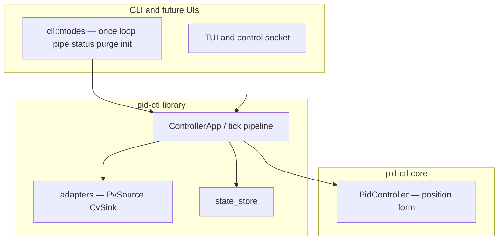

# pid-ctl — Design Plan

A composable, tunable PID controller for the command line, written in Rust.

---

## Goals

- Unix-composable: fits naturally into pipes, cron, systemd, shell scripts
- Flexible I/O: reads PV and writes CV from/to files, commands, sysfs, stdin/stdout
- Operator-friendly: live tuning dashboard with inline educational hints
- LLM/automation-friendly: non-interactive control via Unix socket and persisted state snapshots
- Zero runtime dependencies: single static binary
- Safety & reliability: built to stringent standards suitable for robust industrial-style automation and operator-supervised control

---

## Command Structure

```
pid-ctl <command> [OPTIONS]
```

### Commands

| Command | Description |
|---|---|
| `once` | Read PV once, compute, write CV, save state, exit |
| `loop` | Run continuously at a fixed interval |
| `pipe` | Read PV from stdin line-by-line, emit CV to stdout line-by-line |
| `status` | Query a running loop via socket when available; otherwise print the last persisted state snapshot as formatted JSON and exit. Requires `--state` or `--socket` (or both). With both: tries socket first, falls back to state file on connection refused |
| `purge` | Offline full runtime wipe: clears i_acc, last_pv, last_error, last_cv, iter, effective_sp, and target_sp. Preserves gains, config, name, and created_at. Updates updated_at to now. Requires exclusive lock — fails if a running loop holds it (see Reliability & Operational Safety) |
| `init` | Offline full wipe — delete and recreate state file from scratch. Requires exclusive lock — fails if a running loop holds it |

---

## Modes of Operation

### `once` — Single-Shot

Read PV once, load state, compute PID output, write CV, save state, exit.

**Use cases:** cron jobs, udev rules, shell scripts that own the loop.

```bash
# Fermentation chamber via cron every 60s
pid-ctl once \
  --pv-cmd "curl -s http://inkbird/temp | jq .celsius" \
  --setpoint 18.5 \
  --kp 2.0 --ki 0.1 --kd 0.5 \
  --out-min 0 --out-max 100 \
  --cv-cmd "curl -s -X POST http://sonoff/power?level={cv:url}" \
  --state /var/lib/pid-ctl/ferment.json

# Fan control triggered by udev
pid-ctl once \
  --pv-file /sys/class/thermal/thermal_zone0/temp \
  --setpoint 55000 \
  --kp 0.8 --ki 0.05 --kd 0.2 \
  --scale 0.001 \
  --out-min 0 --out-max 255 \
  --cv-file /sys/class/hwmon/hwmon0/pwm1 \
  --state /tmp/fan-cpu.json

# Distillation column — CV captured by calling script
REFLUX=$(pid-ctl once \
  --pv 78.4 --setpoint 78.1 \
  --kp 1.5 --ki 0.3 --kd 0.0 \
  --out-min 0 --out-max 100 \
  --state /tmp/still-reflux.json \
  --cv-stdout --quiet)
send_valve_command $REFLUX
```

---

### `loop` — Long-Running Daemon

Reads PV, computes, writes CV, waits for next deadline, repeats. Uses deadline-based scheduling: drift is bounded to one tick and never accumulates. If a tick overruns, pid-ctl logs the slip, skips any missed backlog, and resumes at the next scheduled boundary. Designed for systemd, screen, or tmux.

**Use cases:** fan/thermal control, brewing, distillation, any slow physical process needing sustained control.

```bash
# CPU fan control
pid-ctl loop \
  --pv-file /sys/class/thermal/thermal_zone0/temp --scale 0.001 \
  --setpoint 55 --kp 0.8 --ki 0.05 --kd 0.2 \
  --out-min 80 --out-max 255 --cv-precision 0 \
  --cv-file /sys/class/hwmon/hwmon0/pwm1 \
  --state /tmp/fan.json \
  --interval 2s --name fan-cpu --units "°C" --tune

# Continuous still — MQTT in, MQTT out
pid-ctl loop \
  --pv-cmd "mosquitto_sub -h 192.168.1.10 -t still/column_temp -C 1" \
  --setpoint 78.3 \
  --kp 1.5 --ki 0.2 --kd 0.8 \
  --out-min 0 --out-max 100 \
  --cv-cmd "mosquitto_pub -h 192.168.1.10 -t still/reflux_duty -m {cv}" \
  --state /var/lib/pid-ctl/still.json \
  --interval 5s --ramp-rate 5 --deadband 0.1

# GPU fan via nvidia-settings
pid-ctl loop \
  --pv-cmd "nvidia-smi --query-gpu=temperature.gpu --format=csv,noheader,nounits" \
  --setpoint 72 \
  --kp 1.2 --ki 0.08 --kd 0.3 \
  --out-min 30 --out-max 100 \
  --cv-cmd "nvidia-settings -a GPUFanControlState=1 -a GPUTargetFanSpeed={cv}" \
  --state /tmp/gpu-fan.json \
  --interval 3s
```

---

### `pipe` — Stream Mode

Reads PV values line-by-line from stdin, emits CV values line-by-line to stdout. External process owns timing — one tick fires per input line, with no internal sleep. In v1, `pipe` is a pure stream transformer: downstream shell stages or callers own actuator side effects. State is held in memory for the session duration and, if `--state` is set, flushed as a coalesced snapshot for restart/recovery.

**Use cases:** log tailers, sensor streams, simulation/testing.

**`pipe` vs `loop --pv-stdin`:** These are distinct. `pipe` is externally timed — one tick per stdin line, no sleep, stdin in and stdout out, with the upstream and downstream processes owning timing and actuator effects. `loop --pv-stdin` is internally timed — the interval timer fires each tick and blocks waiting for one stdin line, then sleeps until the next deadline. Use `pipe` when the stream owns timing; use `loop --pv-stdin` when you want `loop`'s interval scheduling, TUI dashboard, and socket API.

```bash
# Log tailer where timing is owned externally — use pipe
tail -f /var/log/sensor.log \
  | awk '/temp/ {print $4}' \
  | pid-ctl pipe \
      --setpoint 60.0 --kp 0.5 --ki 0.1 --kd 0.0 \
      --out-min 0 --out-max 255 \
  | xargs -I{} sh -c 'echo {} > /sys/class/hwmon/hwmon0/pwm1'

# MQTT stream → PID → MQTT
mosquitto_sub -h broker -t sensors/temp \
  | pid-ctl pipe \
      --setpoint 22.0 --kp 1.0 --ki 0.05 --kd 0.0 \
      --out-min 0 --out-max 100 \
  | xargs -I{} mosquitto_pub -h broker -t control/heater -m {}

# Simulation: synthetic ramp input
seq 0 100 | awk '{print 20 + $1 * 0.5}' \
  | pid-ctl pipe \
      --setpoint 35.0 --kp 2.0 --ki 0.3 --kd 0.1 \
      --out-min 0 --out-max 100

# Serial temperature sensor — use loop --pv-stdin for interval + dashboard
stty -F /dev/ttyUSB0 9600 raw && cat /dev/ttyUSB0 \
  | pid-ctl loop --pv-stdin \
      --setpoint 65.0 --kp 1.0 --ki 0.1 --kd 0.2 \
      --out-min 0 --out-max 100 \
      --cv-file /sys/class/hwmon/hwmon0/pwm1 \
      --interval 5s --state /tmp/serial-fan.json
```

---

### `--tune` — Interactive Tuning Dashboard

Modifier for `loop` only. Not compatible with `once`, `pipe`, `--quiet`, `--format json`, or non-TTY stdout (see Incompatible Flag Combinations). Renders a live terminal dashboard (via `ratatui` + `crossterm`) with PV, CV, P/I/D breakdown, sparklines, and an interactive gain editor. Educational hints inline throughout.

```bash
pid-ctl loop \
  --pv-cmd "mosquitto_sub -h 192.168.1.10 -t still/column_temp -C 1" \
  --setpoint 78.3 --kp 1.5 --ki 0.2 --kd 0.8 \
  --out-min 0 --out-max 100 \
  --cv-cmd "mosquitto_pub -h 192.168.1.10 -t still/reflux_duty -m {cv}" \
  --state /var/lib/pid-ctl/still.json \
  --interval 5s --tune
```

#### Dashboard Layout

```
pid-ctl  controller=still  interval=5s                      iter 142  11m50s
━━━━━━━━━━━━━━━━━━━━━━━━━━━━━━━━━━━━━━━━━━━━━━━━━━━━━━━━━━━━━━━━━━━━━━━━━━━

  PROCESS                                              HINT
  ───────────────────────────────────────────────────────────────────────
  Setpoint      78.300 °C    ← your target value (ramping from 76.100 when --setpoint-ramp active)
  PV (actual)   78.441 °C    ← what the sensor reads right now
  Error         -0.141 °C    ← how far off you are  (Setpoint - PV)
                             ▼ negative — PV is above target, output reducing

  OUTPUT
  ───────────────────────────────────────────────────────────────────────
  CV            43.2  [████████░░░░░░░] 43%    ← what's being sent to device
  Range         0 – 100

  PID BREAKDOWN                        what each term is doing right now
  ───────────────────────────────────────────────────────────────────────
  P  (proportional)   -0.212    responds to current error — acts immediately
  I  (integral)       -0.034    responds to error over time — fixes drift
  D  (derivative)     +0.011    responds to rate of PV change — slows overshoot
  I accumulator       -0.680    ← anti-windup active — self-corrects when saturated
                                   press r to reset manually if output is stuck

  HISTORY (last 60 ticks / ~5m at 5s interval)
  ───────────────────────────────────────────────────────────────────────
  PV   ▃▃▄▄▄▅▅▄▄▃▃▃▄▄▄▅▄▄▃▃▄|▄▄▄▅▅▄▄▃▃   trending ▲
                              ^ Kp 1.5→2.1
  CV   ▅▅▄▄▄▃▃▄▄▅▅▅▄▄▄▃▄▄▅▅▄|▄▄▄▃▃▄▄▅▅   output is chasing

━━━━━━━━━━━━━━━━━━━━━━━━━━━━━━━━━━━━━━━━━━━━━━━━━━━━━━━━━━━━━━━━━━━━━━━━━━━
  GAINS — ↑↓ select   ←→ adjust   [ ] step size              s save   q quit
  ───────────────────────────────────────────────────────────────────────
  Kp  1.500   how strongly to react to error right now
▶ Ki  0.200   how aggressively to fix long-term drift         [step 0.01  [ ]]
  Kd  0.800   how hard to brake when closing in on target
  SP  78.300  target setpoint

  / _
```

**Sparkline markers:** When a gain changes, a `|` marker is rendered at that tick column. An annotation line below shows the change (e.g. `^ Kp 1.5→2.1`). Changes within 3 columns are merged onto one annotation line; truncated with `…` if too wide. Markers scroll off naturally after `--tune-history` ticks. Sparkline width fills available terminal width and recalculates on resize.

**Tick cadence:** While waiting for the next PID tick, the TUI does not issue a full redraw on every keyboard poll (which would otherwise be up to ~20 Hz with a 50 ms poll cap). Redraws are throttled so terminal work does not dominate wall time; the dashboard still repaints immediately on input or resize, and refreshes more often in the last ~120 ms before a tick so the countdown stays legible. That keeps measured `dt` between tick starts closer to `--interval`, so tuning reflects a production-like loop cadence better than if the UI constantly stole time from the controller path.

#### Keyboard Bindings

| Key | Action |
|---|---|
| `↑` / `↓` | Move focus between gain rows (Kp → Ki → Kd → SP → wrap) |
| `←` / `→` | Decrement/increment focused value by step size |
| `[` / `]` | Halve/double step size for focused row |
| `/` | Enter command mode (line input) |
| `r` | Reset integral accumulator (`i_acc` only). Triggers D-term protection on next tick |
| `s` | Save current gains to state file |
| `c` | Print copy-pasteable full command line for non-interactive use (see below) |
| `h` | Hold/resume — hold last applied CV, keep servicing status/socket |
| `d` | Toggle dry-run (compute but don't write CV) |
| `?` | Toggle help overlay |
| `q` | Quit cleanly (saves state, prints copy-pasteable full command — see below) |

#### Command Mode (`/`)

Press `/` to open a mini command line. As the user types a parameter name, a contextual hint box appears above showing the parameter's purpose, current value, and tuning guidance.

**Supported commands:**

```
kp <value>        set proportional gain
ki <value>        set integral gain
kd <value>        set derivative gain
sp <value>        set target setpoint
interval <dur>    change loop timing (e.g. 500ms, 2s)
reset             clear integral accumulator (i_acc only, triggers D-term protection on next tick)
hold / resume     hold last applied CV while continuing to service status/socket
save              write current gains to state file
export            print copy-pasteable full CLI (same as `c`) — for once/loop/pipe without `--tune`
quit              exit cleanly
```

**Hint box — shown as user types parameter name:**

- `kp` → "Proportional gain — controls immediate reaction to error. Too low: slow/drifting. Too high: oscillates."
- `ki` → "Integral gain — corrects persistent offset over time. Too high: windup/saturation. Tip: press r to clear accumulator after change."
- `kd` → "Derivative gain — brakes output as PV approaches setpoint. Applied to PV rate of change, not error — no kick on setpoint changes. Too high: amplifies noise. Tip: combine with --pv-filter."
- `sp` → "Setpoint — the target value. Large jumps are handled smoothly; use --setpoint-ramp to limit rate of change."
- `reset` → "Clears the I accumulator (i_acc only). Triggers D-term protection on next tick. Use after gain changes or if output is stuck at its limit."
- `interval` → "How often the controller runs. Faster = more responsive but more actuation."
- `export` → "Prints a full copy-pasteable command for this subcommand without `--tune` — use after tuning for cron, systemd, or scripts."
- Unknown input → fuzzy match list of valid parameters.

#### Copy-pasteable command line (`c`, `export`, or on quit)

Interactive tuning adjusts gains (and optionally setpoint, interval, etc.) in memory and in the state file when saved. To run the same controller non-interactively — `once`, `loop`, or `pipe` **without** `--tune` — the dashboard emits a **full** shell-ready line that repeats every flag the user originally passed (PV/CV sources, `--state`, `--interval`, scaling, limits, …) plus the **current** control parameters (`--setpoint`, `--kp`, `--ki`, `--kd`, and any other tunables that differ from defaults).

- Press **`c`** or type **`export`** in command mode to print this line to stderr **without** quitting — useful while iterating.
- On **`q`**, print the same line after clean shutdown so operators can paste into cron, systemd units, or remote shells.

The reconstructed command uses the **same subcommand** as the current session. For cron deployment, the operator changes `loop` → `once` as needed.

Example (abbreviated):

```
# After tuning — paste into scripts or change `loop` → `once` for cron:
pid-ctl loop \
  --pv-cmd "mosquitto_sub -h 192.168.1.10 -t still/column_temp -C 1" \
  --setpoint 78.300 --kp 2.100 --ki 0.050 --kd 0.800 \
  --out-min 0 --out-max 100 \
  --cv-cmd "mosquitto_pub -h 192.168.1.10 -t still/reflux_duty -m {cv}" \
  --state /var/lib/pid-ctl/still.json \
  --interval 5s
```

Short reminder (optional second line if space is tight):

```
Tuned gains only: --kp 2.100 --ki 0.050 --kd 0.800 --setpoint 78.300
```

#### Help Overlay (`?`)

Full-screen, ESC or `?` to dismiss. Includes:
- Plain-English explanation of P, I, D terms and error convention (`error = Setpoint - PV`)
- Tuning tips (start with Ki=0 Kd=0, raise Kp first, etc.)
- Explanation of D-on-measurement (no derivative kick on setpoint changes)
- Full command and key reference (including `c` / `export` for copy-pasteable non-interactive CLI)

---

## PID Implementation

### Error convention

`error = Setpoint - PV`

Positive error: PV is below target — controller pushes output up. Negative error: PV is above target — controller pulls output down.

### Controller form

v1 ships one controller form: **position form** with **D-on-measurement**. Each tick computes an absolute CV.

```
p_term            = Kp * error
d_term            = -Kd * (pv - pv_prev) / dt   # D-on-measurement: no kick on setpoint changes
i_acc_candidate   = i_acc + error * dt
i_term_candidate  = Ki * i_acc_candidate
u_unclamped       = p_term + i_term_candidate + d_term
```

The core owns all deterministic control semantics: setpoint ramping, deadband, PV filtering (EMA), PID term computation, actuator clamping (`out_min`/`out_max`), slew-rate limiting, and anti-windup correction. It returns a fully realized `cv` (clamped and slew-limited) plus diagnostics (`u_unclamped`, P, I, D terms, `i_acc`, `effective_sp`, saturation status). Anti-windup back-calculation uses `actual_applied_cv` from the **previous** tick, which the application layer feeds back into the core as a `StepInput` field. This ensures back-calculation reacts to the value the actuator actually received, not an intermediate computation.

Core state: `i_acc`, `last_pv`, `last_error`, `last_cv`, `effective_sp`.

### D-on-measurement

The derivative term is computed from the rate of change of PV (not error): `d_term = -Kd * (pv - pv_prev) / dt`. This eliminates derivative kick when the setpoint changes.

**Unreliable derivative protection:** When `last_pv` is unavailable or unreliable — first tick (no state file or no prior `last_pv`), after a full offline `purge` (which clears `last_pv`), after a live integrator `reset` (TUI/socket), or after a dt skip — the derivative term is zeroed and `last_pv` is seeded to the current PV. The P and I terms still compute normally. This prevents derivative spikes on startup, after resets, and after gaps. A structured event is emitted: `{"event":"d_term_skipped","reason":"no_pv_prev"}` (or `"reason":"post_dt_skip"`, `"reason":"post_reset"`).

### Anti-windup

Default strategy: **back-calculation** with auto-computed tracking time constant `Tt`:
- When Kd > 0: `Tt = sqrt(Kd / Ki)`
- When Kd = 0: `Tt = Kp / Ki`
- When Ki = 0: anti-windup is inactive

`Tt` is derived automatically from the user's gains. The plan does **not** promise `i_acc` itself lives in output units or sits inside `[out_min, out_max]`. Instead, anti-windup is defined in terms of the **integral contribution** (`i_term = Ki * i_acc`) and the back-calculation correction that pulls that contribution back toward the realizable actuator range whenever the unclamped output saturates.

Basic users see nothing — the TUI hint text on the I accumulator reads: "anti-windup active — accumulator self-corrects when output is saturated."

Auto-computed `Tt` is clamped to `[dt, 100 × interval]` to prevent degenerate behavior at extreme gain ratios. For `once` and `pipe` (no interval), the upper bound is `100s`. This prevents both infinitely aggressive correction (Tt = 0 when Kp = 0) and effectively disabled back-calculation (very large Tt when Ki is tiny).

When Ki is set to 0 at runtime (via TUI or socket), the integrator stops accumulating but `i_acc` is frozen at its current value. Use `reset` or `--reset-accumulator` to clear it.

Advanced overrides (full CLI reference; not shown in basic examples):
- `--anti-windup <back-calc|clamp|none>` — override strategy (default: `back-calc`)
- `--anti-windup-tt <float>` — override auto-computed `Tt`. Bypasses the auto-computed Tt clamp

### Setpoint ramping

When `--setpoint-ramp <float>` is set, the controller maintains two setpoint values:

- **`target_sp`**: where the operator wants to go (set via CLI, TUI, or socket).
- **`effective_sp`**: what the PID actually uses this tick. Moves toward `target_sp` by at most `setpoint_ramp * dt` per tick.

`error = effective_sp - pv` — always computed against the effective setpoint, not the target. Deadband check applies to error computed from the effective setpoint: when `|error| < deadband`, `effective_error = 0` is used for P and I terms (see deadband in Safety & Anti-Windup).

When `effective_sp == target_sp`, the ramp is complete and has no further effect. If the target changes mid-ramp (via TUI `sp` command, socket `{"cmd":"set","param":"sp",...}`, or CLI flag on restart), `target_sp` updates immediately and `effective_sp` continues ramping from its current value toward the new target.

**Initial state:** On first tick with no prior state (no state file or fresh `init`), `effective_sp = target_sp = --setpoint`. No ramp occurs on the first tick. On restart from state file, `effective_sp` and `target_sp` are loaded and ramping resumes where it left off.

**Persistence:** `effective_sp` and `target_sp` are persisted in the state file for `once` continuity. When `--setpoint-ramp` is not set, these fields are absent and `effective_sp = setpoint`.

### `dt` handling

`dt` is actual elapsed wall-clock time, not the configured interval.

- **`loop` and `pipe`**: use `std::time::Instant` (monotonic). Immune to NTP step corrections on bare metal; monotonic clock cannot go backward.
- **`once`**: use `now - updated_at` from the state file (wall-clock delta across process boundaries).

**Anomalous dt protection (all modes):** If measured `dt < --min-dt` or `dt > --max-dt`, the tick is **skipped**: CV is held at its last value, `updated_at` is updated to now (so the next tick gets a fresh dt), and a structured warning is emitted: `{"event":"dt_skipped","raw_dt":<val>}`. The next tick after a dt skip also zeroes the D term and seeds `last_pv`, since the derivative would span an unmeasured gap (see D-on-measurement: unreliable derivative protection).

**`once` defaults to clamp, not skip:** For `once`, `--dt-clamp` behavior is the default. Long gaps between `once` invocations are normal (cron, manual scripts), not anomalous. Out-of-range dt is clamped to `--max-dt` and the tick computes with a warning. The user can still set explicit `--min-dt`/`--max-dt` or `--dt <fixed>` to override.

`--dt-clamp` overrides skip behavior for `loop` and `pipe`: clamps dt to the valid range and computes (with a warning). `--dt <float>` sets a fixed dt for every tick, bypassing all bounds checks — useful for testing and for gains that are explicitly per-interval rather than per-second.

### Scheduling

`loop` uses deadline-based scheduling (`tokio::time::interval()`). The next tick fires at `last_deadline + interval`, not `now + interval`. Drift is bounded to one tick and never accumulates.

**Missed-tick policy:** if a tick overruns, pid-ctl does not replay backlog or run catch-up bursts. It logs the slip and resumes at the next scheduled boundary.

All durations are stored and compared internally as `std::time::Duration` (integer nanoseconds). Conversion to `f64` seconds happens only at PID math callsites.

---

## Reliability & Operational Safety

pid-ctl is built to stringent reliability standards suitable for robust industrial-style automation and operator-supervised control. It can participate in higher-level safety systems, but v1 is not itself a certified or standalone safety function. Physical safeties, interlocks, and independent shutdown mechanisms remain required. The following principles are enforced throughout the codebase:

1. **No silent failures.** Every failure produces a log entry (stderr + `--log` if set) and a structured JSON event. Nothing fails quietly.
2. **All external operations have bounded waits.** Command execution and stdin reads are user-configurable via `--cmd-timeout` / `--pv-stdin-timeout`. State flushes, socket I/O, and shutdown sequencing use internal bounded waits that are not user-configurable in v1. No unbounded waits.
3. **Fail-safe on PV loss.** On any PV read failure, write `--safe-cv` if configured, else hold last CV and skip tick. Never compute with missing PV.
4. **Atomic state snapshot writes.** Always write to a temp file and rename — never partial state. The on-disk file is a crash-safe snapshot for restart/recovery and offline inspection, not a live IPC surface.
5. **Startup validation.** All configuration validated before any I/O. Bad config = exit 3, no partial execution.
6. **Clean shutdown on SIGTERM/SIGINT.** Finish current tick, write `--safe-cv` if configured, flush the latest state snapshot synchronously, kill child processes, close socket, release the lockfile, exit 0. On SIGKILL: atomic rename ensures the state file is always fully written or unchanged.
7. **No zombie processes.** Child processes from `--pv-cmd`/`--cv-cmd` are always waited on or killed within the tick timeout.
8. **CV writes verified where possible.** After writing `--cv-file`, optionally re-read to confirm the write was accepted. Use `--verify-cv` for safety-critical deployments (off by default for sysfs performance).
9. **Anti-windup is defined in output terms, not accumulator units.** Saturation handling constrains the integral contribution via back-calculation behavior; the plan does not rely on `i_acc` numerically matching actuator units.
10. **Interval slip is logged (unattended `loop` only).** When a tick takes longer than `--interval`, emit `{"event":"interval_slip","actual_ms":...}` and record that backlog was skipped. Interactive `loop --tune` does **not** emit this event: measured time between tick starts can exceed `--interval` while servicing subprocess I/O and (to a lesser extent) the TUI; that mix is not the same failure mode as a slow headless loop. The tune dashboard also throttles idle full-frame redraws so UI rendering is less likely to stretch `raw_dt` without a corresponding change in the plant or controller.
11. **Deadline-based scheduling with no catch-up bursts.** `loop` uses `tokio::time::interval()` — fires at absolute deadlines, not relative sleeps. Drift is bounded to one tick, never accumulates, and missed ticks are not replayed.
12. **Durations are integer nanoseconds internally.** All `Duration` values stored and compared as `std::time::Duration`. Conversion to `f64` seconds happens only at PID math callsites. No float-based time arithmetic elsewhere.
13. **Single-writer exclusivity uses a lockfile when `--state` is set.** `flock(2)` is held on a dedicated lockfile (`<state>.lock`), not on the state-file inode itself. `loop` holds it for process lifetime; `once` takes it for the duration of the run. `purge` and `init` require the exclusive lock for state mutation — if another instance holds it, they exit with a clear error directing the operator to the socket API (for live integrator reset) or to stop the controller first. `status` reads snapshots directly and uses the socket for live state. Without `--state`, no locking is enforced — the operator is responsible for ensuring only one writer targets a given actuator. **State paths on NFS mounts are unsupported** — `flock` is unreliable over NFS.
14. **State write failure policy is mode-dependent.** In `loop` and `pipe`, state write failures are non-fatal — the controller keeps running with loud failure signaling. After `--state-fail-after` consecutive write failures, escalate to a prominent stderr warning each cycle. In `once`, a state write failure is a **degraded success**: the computed CV has already been emitted, but the process exits with code 4 and warns that continuity state was not persisted. This signals to callers that the next `once` invocation may use stale `dt`, `i_acc`, `last_pv`, or setpoint ramp state.
15. **Derivative term requires a valid prior measurement.** When `last_pv` is unavailable or unreliable (first tick, post-reset, post-dt-skip), the D term is zeroed and `last_pv` is seeded to the current PV. No derivative spike on startup or after gaps.
16. **Mutual exclusivity of sources and sinks.** Exactly one PV source and one CV sink must be specified. Multiple sources or sinks produce exit 3 at startup.
17. **CV write failure policy is mode-dependent.** In `once`: if the CV sink write fails or times out, exit code 5 — the computed CV is not treated as applied, and `last_cv` in state retains the last confirmed-applied value. In `loop`: emit `{"event":"cv_write_failed",...}`, do not update `last_cv`, and count consecutive failures; after `--cv-fail-after` consecutive CV write failures, exit code 2. In `pipe`: exit on stdout write error or broken pipe per normal Unix convention (SIGPIPE). `last_cv` always means the last value confirmed written to the actuator, not the last computed value.

---

## Full CLI Reference

### PV Source (exactly one required for `once` and `loop`; `pipe` uses stdin implicitly)

| Flag | Description |
|---|---|
| `--pv <float>` | Literal PV value |
| `--pv-file <path>` | Read first line of file, parse as float. Supports `/sys/`, `/dev/`, `/proc/` |
| `--pv-cmd <shell>` | Execute shell string, parse stdout as float. Runs each iteration. Subject to `--pv-cmd-timeout` |
| `--pv-stdin` | (`loop` only) Read one PV from stdin per iteration. The interval timer drives ticks; each tick blocks for one line up to `--pv-stdin-timeout`. On timeout, treated as PV read failure. See `pipe` vs `loop --pv-stdin` in Modes of Operation |

Specifying more than one PV source is exit 3: `only one PV source may be specified`. `pipe` reads PV from stdin intrinsically and rejects all `--pv*` flags (see Incompatible Flag Combinations).

### CV Sink (exactly one required for `once` and `loop` unless `--dry-run`; `pipe` always writes CV to stdout)

| Flag | Description |
|---|---|
| `--cv-file <path>` | Write CV to file. Truncates on each write. Supports `/sys/` |
| `--cv-cmd <shell>` | Execute shell string with `{cv}` substituted (formatted to `--cv-precision` decimal places, leading `-` for negatives). Use `{cv:url}` for URL-encoded substitution in HTTP commands (e.g. `curl -X POST http://device/control?level={cv:url}`). Subject to `--cv-cmd-timeout` |
| `--cv-stdout` | Write CV to stdout, one value per line (`once`/`loop` only). Redundant with `pipe`, which always writes to stdout |

Specifying more than one CV sink is exit 3: `only one CV sink may be specified`. Not applicable to `pipe`, which hardcodes stdout.

### PID Parameters

| Flag | Default | Description |
|---|---|---|
| `--setpoint <float>` | required on first run | Target value, same units as PV. Optional if state file already contains a setpoint (loaded per flag precedence rules) |
| `--kp <float>` | 1.0 | Proportional gain |
| `--ki <float>` | 0.0 | Integral gain |
| `--kd <float>` | 0.0 | Derivative gain |
| `--setpoint-ramp <float>` | disabled | Max setpoint change per second. Creates an internal effective setpoint that ramps toward the target at this rate. Error uses effective setpoint. Ramp state persisted in state file for `once` continuity. See Setpoint ramping in PID Implementation |

**Flag precedence:** CLI flags always win over state file values. If a flag is omitted and the state file contains a value, the state file value is used. `--setpoint` is required only when absent from both CLI and state file (first run).

### Scaling & Filtering

| Flag | Default | Description |
|---|---|---|
| `--scale <float>` | 1.0 | Multiplied into the raw PV reading before any filtering or PID computation. Does not affect CV output (e.g. `0.001` for sysfs millidegrees) |
| `--pv-filter <float>` | 0.0 | EMA smoothing factor, range [0.0, 1.0). `0.0` = no filtering, `0.99` = heavy filtering. Formula: `filtered = (1 - alpha) * raw + alpha * prev`. Reduces derivative noise. Filter state is persisted via `last_pv` in the state file (see State File Schema) for `once` continuity. First tick with no prior `last_pv`: no filtering (raw scaled PV used as seed) |
| `--cv-precision <int>` | 2 | Decimal places in CV output. Use `0` for integer PWM registers. Applied to `{cv}` and `{cv:url}` substitutions |

### Safety & Anti-Windup

| Flag | Default | Description |
|---|---|---|
| `--out-min <float>` | -inf | Clamp CV to minimum. Defines the low end of the realizable actuator range that anti-windup tracks |
| `--out-max <float>` | +inf | Clamp CV to maximum. Defines the high end of the realizable actuator range that anti-windup tracks |
| `--deadband <float>` | 0.0 | When \|error\| < deadband, use `effective_error = 0` for P and I terms. Controller state still updates: `last_pv` is refreshed, setpoint ramp advances, output limiting applies, and D-term remains measurement-based. This prevents stale state accumulation while suppressing small-error actuation |
| `--ramp-rate <float>` | disabled | Max CV change per second. Scaled to per-tick using actual elapsed dt. Consistent when interval changes mid-run |
| `--safe-cv <float>` | — | CV to write on PV read failure or clean shutdown. Without this, exit 1 (`once`) or skip iteration (`loop`) on PV failure; hold last CV on shutdown |
| `--fail-after <int>` | disabled | Exit code 2 after N consecutive PV failures |
| `--cv-fail-after <int>` | disabled | Exit code 2 after N consecutive CV write failures. Analogous to `--fail-after` for PV. See Reliability item 17 |
| `--verify-cv` | off | After writing `--cv-file`, re-read to confirm the write was accepted. For safety-critical deployments |
| `--reset-accumulator` | off | Zero the integral accumulator (`i_acc`) before the first tick. Gains, setpoint, iter, and other state are preserved. Use when restarting a controller that may have stale windup from a previous run. Available for `once` and `loop` |
| `--anti-windup <back-calc\|clamp\|none>` | back-calc | Anti-windup strategy. Default back-calculation with auto-computed Tt. Advanced flag |
| `--anti-windup-tt <float>` | auto | Override auto-computed back-calculation tracking time constant. Bypasses the auto-computed Tt clamp. Advanced flag |

### Timing & dt

| Flag | Default | Description |
|---|---|---|
| `--dt <float>` | — | Fixed dt override (seconds) for every tick. Bypasses all bounds checks. Useful for testing and for gains that are explicitly per-interval rather than per-second |
| `--min-dt <float>` | 0.01s | Minimum valid dt. Ticks with smaller measured dt are skipped (CV held, warning emitted) |
| `--max-dt <float>` | 3× `--interval`, or 60s | Maximum valid dt. Ticks with larger measured dt are skipped (`loop`/`pipe`) or clamped (`once` — see below). Protects against NTP corrections, VM migration, suspend/resume |
| `--dt-clamp` | **on for `once`**, off for `loop`/`pipe` | When set, clamp out-of-range dt and compute rather than skipping (with warning). Defaults to on for `once` because long gaps between invocations are normal |

### State

| Flag | Description |
|---|---|
| `--state <path>` | JSON state snapshot. Stores i_acc, last_error, last_pv, last_cv, iter, gains, setpoint, timestamps. Created if absent. Without this, state is in-memory only. The snapshot is for restart/recovery and offline inspection, not live IPC. **NFS paths unsupported** |
| `--state-write-interval <duration>` | Max frequency of state snapshot flushes. Default: `max(tick_interval, 100ms)` for `loop`; `1s` for `pipe`. In-memory state is always current; disk writes are coalesced |
| `--state-fail-after <int>` | Consecutive state write failures before escalating to prominent per-cycle stderr warning (default: 10). Write failures are never fatal |

### Tuning Dashboard

| Flag | Description |
|---|---|
| `--tune` | Open interactive tuning dashboard. Requires TTY and `loop`. Not compatible with `pipe`, `--quiet`, `--format json`, or `once`. See Incompatible Flag Combinations |
| `--tune-history <int>` | Number of ticks to retain in sparkline history (default: 60). Header shows equivalent wall time |
| `--tune-step-kp <float>` | Initial `←`/`→` step size for Kp (default: 0.1) |
| `--tune-step-ki <float>` | Initial `←`/`→` step size for Ki (default: 0.01) |
| `--tune-step-kd <float>` | Initial `←`/`→` step size for Kd (default: 0.05) |
| `--tune-step-sp <float>` | Initial `←`/`→` step size for Setpoint (default: 0.1) |

### Output & Logging

| Flag | Default | Description |
|---|---|---|
| `--format <text\|json>` | text | `json` emits one NDJSON object per line per iteration: `{schema_version, ts, iter, pv, sp, effective_sp?, err, p, i, d, cv, i_acc}` (`effective_sp` present only when `--setpoint-ramp` is active). When active, all non-iteration output goes to stderr only. Incompatible with `pipe` and `--cv-stdout` (stdout can carry raw CV or JSON, not both — see Incompatible Flag Combinations). Example: `pid-ctl loop ... --format json \| jq '.cv'` |
| `--quiet` | — | Suppress all output except CV (when `--cv-stdout`) or stderr errors |
| `--log <path>` | — | Append one NDJSON line per iteration, always regardless of `--format`. Also receives structured event records (dt_skipped, interval_slip, state_write_failed, cv_write_failed, gains_changed, gains_saved, etc.) |
| `--units <string>` | — | PV unit label for display only |
| `--name <string>` | — | Controller name in dashboard and JSON output. Defaults to the stem of `--state` path (e.g. `ferment` from `ferment.json`), or `pid-ctl` if no state file |
| `--verbose` | — | Extra iteration logging (distinct from `--tune`) |

### Diagnostics

| Flag | Description |
|---|---|
| `--dry-run` | Compute but don't write CV. State still saved. Independent of `--tune` — works fully headless. Combine with `--tune` to watch the controller without touching the actuator |

### Command Timeouts

Available to all modes that use external commands (`once`, `loop`). Ensures no unbounded waits per Reliability principle 2.

| Flag | Default | Description |
|---|---|---|
| `--cmd-timeout <duration>` | `min(--interval, 30s)` for `loop`; `30s` for `once` | Default timeout for `--pv-cmd` and `--cv-cmd` |
| `--pv-cmd-timeout <duration>` | `--cmd-timeout` | Override `--cmd-timeout` for `--pv-cmd` only |
| `--cv-cmd-timeout <duration>` | `--cmd-timeout` | Override `--cmd-timeout` for `--cv-cmd` only |

### Loop-only

| Flag | Description |
|---|---|
| `--interval <duration>` | Loop timing. Format: `500ms`, `2s`, `1m` |
| `--socket <path>` | In `loop`: create a JSON control socket listener for live control and status (see LLM/Automation API). In `status`: connect to a running loop's socket as a read-only client. Errors on all other subcommands. The only supported live-control path for a running loop |
| `--socket-mode <octal>` | Socket permissions (default: `0600`). Use `0660` with a shared Unix group for multi-user service setups. On startup, if socket path exists: connect test first — if refused, delete and recreate; if accepted, exit 3 (another instance running). Socket deleted on clean shutdown |
| `--pv-stdin-timeout <duration>` | Timeout waiting for stdin line in `loop --pv-stdin` (default: `--interval` duration). On timeout, treated as PV read failure |

### Exit Codes

| Code | Meaning |
|---|---|
| 0 | Clean exit |
| 1 | PV read failure with no `--safe-cv` |
| 2 | `--fail-after` or `--cv-fail-after` limit reached |
| 3 | Bad configuration or incompatible flag combination |
| 4 | Degraded success — CV was emitted but state persistence failed (`once` only) |
| 5 | CV write failure (`once` only — CV was not applied) |

### Incompatible Flag Combinations

All of the following produce exit 3 with a descriptive error message. No partial execution occurs.

| Combination | Error message |
|---|---|
| `--tune` with `once` | `--tune requires loop` |
| `--tune` with `pipe` | `--tune is unavailable with pipe — pipe is a pure stdin→stdout transformer in v1` |
| `--tune` with `--quiet` | `--tune and --quiet are incompatible — tune requires a TTY` |
| `--tune` with `--format json` | `--tune and --format json are incompatible` |
| `--tune` without a TTY | `--tune requires a TTY; use --format json for non-interactive output` |
| `--socket` with any subcommand other than `loop` or `status` | `--socket is only valid with loop and status` |
| `--dry-run` with `pipe` | `--dry-run is not meaningful with pipe — pipe has no side effects to suppress` |
| `pipe` with `--pv`, `--pv-file`, `--pv-cmd`, or `--pv-stdin` | `pipe reads PV from stdin intrinsically — PV source flags are not accepted` |
| `pipe` with `--cv-file` or `--cv-cmd` | `pipe always writes CV to stdout in v1 — move actuator side effects to the next shell stage` |
| Multiple PV sources | `only one PV source may be specified` |
| Multiple CV sinks | `only one CV sink may be specified` |
| `pipe` with `--format json` | `--format json writes to stdout, which conflicts with pipe's CV output — use --log for machine-readable telemetry` |
| `--cv-stdout` with `--format json` | `--format json writes to stdout, which conflicts with --cv-stdout — use --log for machine-readable telemetry` |
| `--state` on NFS mount | `state path appears to be on NFS — flock on the lockfile is unreliable over NFS, use a local path` |

---

## LLM / Automation API

Two non-interactive mechanisms are available, with different roles. For a **running `loop`**, live control is **socket-first**. The state file remains useful for restart/recovery, `once`, and offline automation, but it is not a live mutation surface for a running controller.

### Mechanism A: Unix Domain Socket

A running `pid-ctl loop` instance listens on a socket when `--socket` is set. Any process can send JSON commands and receive JSON responses. No TTY required. This is the recommended mechanism for live LLM-based tuning of running processes. The `status` subcommand can also connect to a running loop's socket as a read-only client (see `--socket` in CLI Reference).

```bash
pid-ctl loop ... --socket /tmp/fan.sock

# Query state
echo '{"cmd":"status"}' | nc -U /tmp/fan.sock

# Push a gain change
echo '{"cmd":"set","param":"kp","value":1.2}' | nc -U /tmp/fan.sock

# Reset accumulator
echo '{"cmd":"reset"}' | nc -U /tmp/fan.sock

# Hold/resume
echo '{"cmd":"hold"}' | nc -U /tmp/fan.sock
echo '{"cmd":"resume"}' | nc -U /tmp/fan.sock

# Save state
echo '{"cmd":"save"}' | nc -U /tmp/fan.sock
```

**Response format:**

```json
// status
{"ok":true,"iter":47,"pv":57.341,"sp":55.0,"err":-2.341,"kp":0.8,"ki":0.05,"kd":0.2,"cv":142,"i_acc":-8.23}

// set
{"ok":true,"param":"kp","old":0.8,"new":1.2}

// reset
{"ok":true,"i_acc_before":-8.23}

// error — unknown command
{"ok":false,"error":"unknown command","available":["status","set","reset","hold","resume","save"]}

// error — unknown parameter for set
{"ok":false,"error":"unknown parameter","settable":["kp","ki","kd","sp","interval"]}
```

**Settable parameters (v1):** `kp`, `ki`, `kd`, `sp`, `interval`. These match the TUI command mode scope. Other config (`out_min`, `out_max`, `deadband`, `ramp_rate`, `safe_cv`) requires a restart.

**Live `interval` changes and derived defaults:** When `interval` is changed at runtime (via TUI or socket), derived defaults that are semantically tied to the interval — `--max-dt` (3×interval), `--pv-stdin-timeout` (interval), `--state-write-interval` (max(interval, 100ms)) — are recomputed to track the new interval, **unless** the user explicitly set them on the command line. `--cmd-timeout` is frozen at its startup value regardless, since it governs external process behavior rather than controller timing.

**Best for:** Live agentic tuning loops. An LLM reads state, reasons about gain changes, pushes updates, waits an interval, reads again.

### Mechanism B: Persisted State Snapshot

The state file stores the last persisted controller snapshot. It is suitable for:
- bootstrapping the next `once` run
- carrying gains, setpoint, and runtime state across restarts
- offline inspection and offline edits while the controller is stopped

It is **not** a supported live control path for a running `loop`. A running controller should be queried and mutated through the socket. External writers must use atomic rename (`mv tmp → state`) to avoid partial reads.

```json
{
  "kp": 0.8,
  "ki": 0.05,
  "kd": 0.2,
  "i_acc": -8.23,
  "last_cv": 142,
  "last_pv": 57.341,
  "iter": 47
}
```

```bash
# LLM reads the offline snapshot
cat /tmp/fan.json | jq '{kp,ki,kd,last_pv,last_cv,i_acc}'

# LLM edits gains for the next start / next once invocation
jq '.kp = 1.2' /tmp/fan.json > /tmp/fan.json.tmp \
  && mv /tmp/fan.json.tmp /tmp/fan.json
```

**Best for:** Slow processes, `once`, and restart persistence. Works even when the controller is not running — updated values are picked up on the next invocation or next startup.

### Comparison

| | Socket | State File |
|---|---|---|
| Best for | Live loop tuning | Slow processes, cron, `once` |
| Works when controller is stopped | No | Yes |
| Latency | Next iteration boundary | Next invocation / next restart |
| LLM tool needed | Shell (`nc -U`) | File read/write |
| Bidirectional | Yes | Offline only |

### LLM Agentic Tuning Loop (example)

```
1. shell: pid-ctl loop ... --socket /tmp/fan.sock &
2. shell: echo '{"cmd":"status"}' | nc -U /tmp/fan.sock
   → observe pv, err, cv, i_acc, current gains
3. reason: error growing, I accumulator saturated, Kp too low
4. shell: echo '{"cmd":"set","param":"kp","value":1.2}' | nc -U /tmp/fan.sock
5. shell: echo '{"cmd":"reset"}' | nc -U /tmp/fan.sock
6. sleep 10s
7. shell: echo '{"cmd":"status"}' | nc -U /tmp/fan.sock
   → observe whether error is shrinking
8. repeat until settled
9. shell: echo '{"cmd":"save"}' | nc -U /tmp/fan.sock
```

No custom LLM integration required — only shell and file tools. Use the socket for live loops; use state-file edits only between runs or for `once`-driven workflows.

---

## Systemd Integration

pid-ctl is designed to run cleanly under systemd. It handles SIGTERM gracefully (finishes current tick, flushes the latest state snapshot, writes `--safe-cv` if configured, exits 0).

### Example unit file

```ini
[Unit]
Description=pid-ctl CPU fan controller
After=network.target

[Service]
ExecStart=/usr/local/bin/pid-ctl loop \
  --pv-file /sys/class/thermal/thermal_zone0/temp --scale 0.001 \
  --setpoint 55 --kp 0.8 --ki 0.05 --kd 0.2 \
  --out-min 80 --out-max 255 --cv-precision 0 \
  --cv-file /sys/class/hwmon/hwmon0/pwm1 \
  --state /var/lib/pid-ctl/fan-cpu.json \
  --interval 2s --safe-cv 128
ExecStop=/bin/kill -TERM $MAINPID
KillMode=mixed
TimeoutStopSec=10s
Restart=on-failure
RestartSec=5s

[Install]
WantedBy=multi-user.target
```

**Notes:**
- `KillMode=mixed` + `TimeoutStopSec=10s` gives pid-ctl time to finish its current tick before systemd sends SIGKILL.
- `--safe-cv 128` (50% fan) is written on shutdown so the fan keeps running after the controller exits.
- For multi-user socket access, add `--socket-mode 0660` and configure a shared group: `SupplementaryGroups=pid-ctl` in the unit, and add operators to the `pid-ctl` group.
- State file directory should be pre-created: `StateDirectory=pid-ctl` in `[Service]` (systemd 235+), which creates `/var/lib/pid-ctl/` owned by the service user.

---

## Architecture & Code Structure

The codebase is organized so a **small, testable core** owns all PID semantics, while **application orchestration** (timing, persistence, I/O contracts) sits in a middle layer, and **user-facing surfaces** (CLI today; other UIs later) stay at the edge. Dependencies point **inward**: outer layers may depend on inner ones; the core depends on nothing pid-ctl–specific beyond `std`.

### Principles

- **Verified core:** All deterministic control semantics — PV filtering, deadband, setpoint ramping, PID computation, output clamping, slew-rate limiting, and anti-windup — live behind a narrow API (`step`, `reset_integral`, `set_gains`, …). No files, sockets, terminals, or `clap` types inside the core. Unit tests and **property-based tests** target this layer first.
- **Core tests are not tied to the wall clock:** The `pid-ctl-core` test suite (unit tests, property tests, fuzz) must not depend on real time elapsing. Time enters the core only as explicit `dt` (or equivalent) supplied by callers or tests. It must be possible to run core tests **faster than realtime** — exercising many simulated ticks per wall-clock second — without `sleep`, without reading `Instant::now()` / system time inside the core for control decisions, and without flakiness from scheduling. (Runtime modes still use monotonic or wall clocks in the **application** layer to *measure* `dt` before calling `step`; that is outside the core.)
- **Multiple instances in code:** The core type is **owned and cheap to construct** (`PidController` holding config + runtime state). The CLI may only ever run one controller process, but libraries and future UIs can allocate N instances without global singletons.
- **Modes belong to the CLI (and future UIs):** `once`, `loop`, `pipe`, `status`, `purge`, and `init` are **entrypoints** in the CLI layer. They parse args, build adapters, and call into the application layer.
- **Encapsulation:** I/O is expressed as **traits** implemented in an `adapters` area. The application layer depends on traits; the CLI wires concrete implementations.



### Suggested layout: Cargo workspace

A **workspace** enforces boundaries with the compiler: `pid-ctl-core` cannot import `clap` or `ratatui`.

| Crate / package | Role |
|---|---|
| `pid-ctl-core` | All deterministic control math: PV filtering, deadband, setpoint ramping, PID computation (position-form, D-on-measurement), output clamping, slew-rate limiting, anti-windup. Pure in-memory state. No serde, no async. |
| `pid-ctl` (library) | Orchestration: tick pipeline (dt measurement, PV read, core step, CV write), state snapshot load/save with coalescing, `fail-after` / `cv-fail-after`, `safe-cv`, dry-run, lockfile exclusivity. Depends on `core` + trait definitions for PV/CV. |
| `pid-ctl` (binary) or `pid-ctl-cli` | `main`, `clap` graph, **mode handlers** (`run_once`, `run_loop`, …), TUI, control socket. Depends on `pid-ctl` lib. |

```text
pid-ctl/
  crates/
    pid-ctl-core/
      src/lib.rs          # PidController, PidConfig, StepInput, StepResult, errors
      src/filter.rs       # EMA filter
    pid-ctl/
      src/lib.rs          # re-exports for library consumers
      src/app/
        mod.rs            # ControllerApp / Session — owns PidController + iteration policy
        tick.rs           # single iteration: validate dt → read PV → step → write CV → persist
        state_store.rs    # JSON state snapshot: load, save (coalesced), atomic rename, lockfile handling (serde here)
        dt.rs             # dt measurement, bounds check, Instant vs wall-clock
      src/adapters/
        pv.rs             # PvSource implementations (file, cmd, literal, stdin, …)
        cv.rs             # CvSink implementations
      src/cli/
        main.rs           # binary entry (or bin/pid-ctl.rs)
        args.rs           # clap definitions, shared options
        modes/
          once.rs
          loop.rs
          pipe.rs
          status.rs
          purge.rs
          init.rs
        tune/             # TUI dashboard, command mode — only used by loop + --tune
        socket.rs         # JSON control socket (loop-only)
```

### Core API (illustrative)

- **`PidConfig`** — setpoint, Kp/Ki/Kd, output limits (`out_min`/`out_max`), deadband, setpoint ramp rate, slew rate, PV filter coefficient, anti-windup config. Clone + update fields for tuning without touching global state.
- **`PidController`** — holds **runtime** state (I accumulator, last_pv, last_error, last_cv, effective_sp). **`fn step(&mut self, input: StepInput) -> StepResult`** where `StepInput` contains scaled PV, `dt` (as `f64` seconds, converted at callsite from `Duration`), and `prev_applied_cv` (the actual CV confirmed written to the actuator on the previous tick, for anti-windup back-calculation).
- **`StepResult`** — `cv` (final, clamped and slew-limited), `u_unclamped`, per-term diagnostics (P, I, D, `i_acc`), `effective_sp`, and `saturated` (true when `u_unclamped` was clipped by output limits, for logging/TUI).
- **No I/O:** Callers supply scaled PV, dt, and previous applied CV; the core applies filtering, deadband, PID computation, clamping, and slew-rate limiting, returning a fully realized CV and diagnostics. No files, sockets, or terminals.
- **Error convention:** `error = setpoint - pv`. D term uses D-on-measurement: `-(pv - pv_prev) / dt`.

Verification strategy for `pid-ctl-core`:

- Table-driven tests for known examples (step response, saturation, windup, setpoint change with D-on-measurement).
- Property tests: e.g. with Ki=Kd=0, bounded output; clamp invariants; reset clears I term; no derivative kick on setpoint-only changes.
- Fuzz the core crate's `step` (fast, no I/O).
- All of the above are **time-as-data**: inject `dt` directly; do not bind test correctness to wall-clock duration. This keeps the suite fast, deterministic, and CI-safe.
- Tests are **behavioral** (“social”): they exercise the **public API** (`PidConfig`, `PidController::step`, `StepInput` / `StepResult`, and any other documented surface) and assert **output-for-input correctness** and invariants that matter to callers (e.g. CV within limits, documented error convention). They do **not** pin internal implementation details — private fields, helper call order, or algorithm structure may change without test churn as long as observable behavior stays correct.

### Application layer (`pid-ctl` lib)

- **`ControllerApp` (or `Session`)** — owns `PidController`, optional **state snapshot** store plus lockfile handle, coalesced write scheduler, counters for `--fail-after`, and references to **`PvSource` / `CvSink`** traits.
- **Single tick:** `measure_dt → validate_dt → read_pv → scale → core.step(input with prev_applied_cv) → write_cv → record_applied_cv → coalesce_state_write`. The core handles filtering, deadband, PID computation, clamping, and slew-rate limiting internally. The application layer's role is dt measurement, I/O, persistence, and feeding back the confirmed-applied CV for anti-windup. Same tick path reused from `once`, `loop`, and `pipe`.
- **Loop vs pipe vs once** differ only in **how** the app is driven (one call vs deadline-based interval vs stream), not in PID math.

### Key Crates (by layer)

| Crate | Where | Use |
|---|---|---|
| `clap` | CLI binary only | Parsing |
| `serde` / `serde_json` | `pid-ctl` lib (state + socket protocol) | Persistence and IPC |
| `ratatui` / `crossterm` | `cli::tune` | Dashboard |
| `tokio` | CLI (`loop` + socket) | Deadline-based interval, async socket listener; **keep `pid-ctl-core` sync** |
| `fs2` or `rustix` | `pid-ctl` lib | `flock(2)` for lockfile-based single-writer exclusivity |

---

## State File Schema

```json
{
  "schema_version": 1,
  "name": "fan-cpu",
  "kp": 0.8,
  "ki": 0.05,
  "kd": 0.2,
  "setpoint": 55.0,
  "effective_sp": 53.2,
  "target_sp": 55.0,
  "i_acc": -8.23,
  "last_error": -2.341,
  "last_cv": 142.0,
  "last_pv": 57.341,
  "iter": 47,
  "created_at": "2026-04-04T12:00:00Z",
  "updated_at": "2026-04-04T14:23:01Z"
}
```

**Notes:**
- `last_pv`: the **filtered** PV value (after `--scale` and `--pv-filter`) used in the most recent PID computation. This allows `once` to resume EMA filtering across invocations. On first tick with no prior `last_pv`, raw scaled PV is used as the seed.
- `last_cv`: the last CV value confirmed written to the actuator. If the most recent CV write failed, this retains the previous confirmed-applied value. Used for anti-windup back-calculation on the next tick.
- `last_error`: stored as `Setpoint - PV` (standard convention).
- `effective_sp`, `target_sp`: only present when `--setpoint-ramp` is active. When absent, `effective_sp = target_sp = setpoint`. See Setpoint ramping.
- `name`: defaults to state file stem if `--name` not set.
- External writers must use atomic rename (`mv tmp → state`). See Reliability & Safety Policy.
- The file is a persisted snapshot. A running `loop` does not watch it for live changes; use the socket for live control.

**Schema contract:**
- `schema_version`: integer, currently `1`. Incremented on breaking changes.
- Unknown fields are silently ignored on load — forward-compatible with newer writers.
- Missing optional fields default safely (e.g. `i_acc` defaults to `0.0`, `iter` to `0`).
- If `schema_version` is greater than the binary's supported major version, pid-ctl exits with code 3 and a clear error.
- External editors should only modify documented stable fields (`kp`, `ki`, `kd`, `setpoint`, `i_acc`). Other fields are internal and may change between versions.

---

## JSON Log Line Schema

Per-iteration record (NDJSON, one object per line):

```json
{
  "schema_version": 1,
  "ts": "2026-04-04T14:23:01Z",
  "name": "fan-cpu",
  "iter": 47,
  "pv": 57.341,
  "sp": 55.0,
  "effective_sp": 53.2,
  "err": -2.341,
  "p": -1.873,
  "i": -0.412,
  "d": 0.024,
  "cv": 142.0,
  "i_acc": -8.23,
  "dt": 2.001
}
```

- `sp`: target setpoint. `effective_sp`: the value used for error computation (present only when `--setpoint-ramp` is active; omitted when equal to `sp`).

**NDJSON schema contract:** All records (iteration and event) include `schema_version` (currently `1`). Unknown fields should be ignored by consumers. The iteration record field set (`ts`, `iter`, `pv`, `sp`, `err`, `p`, `i`, `d`, `cv`, `i_acc`, `dt`) is stable within a major version. Event records (`event` field present) may introduce new event types in minor versions.

**Gain events** (emitted on gain changes; `source`: `tui` or `socket`):

```json
// In-memory change (not yet saved to state file)
{"event":"gains_changed","ts":"2026-04-04T14:31:00Z","kp":2.1,"ki":0.05,"kd":0.8,"sp":78.3,"iter":142,"source":"tui"}

// Written to state file
{"event":"gains_saved","ts":"2026-04-04T14:31:05Z","kp":2.1,"ki":0.05,"kd":0.8,"sp":78.3,"i_acc":-0.68,"iter":142}
```

**Structured warning events:**

```json
{"event":"dt_skipped","ts":"...","raw_dt":47.3,"min_dt":0.01,"max_dt":6.0}
{"event":"dt_clamped","ts":"...","raw_dt":47.3,"clamped_dt":6.0}
{"event":"d_term_skipped","ts":"...","reason":"no_pv_prev","iter":0}
{"event":"interval_slip","ts":"...","interval_ms":2000,"actual_ms":2340}
{"event":"state_write_failed","ts":"...","path":"/tmp/fan.json","error":"No space left on device","consecutive_failures":3}
{"event":"cv_write_failed","ts":"...","sink":"cmd","error":"exit code 1","consecutive_failures":3}
{"event":"cv_write_timeout","ts":"...","cmd":"nvidia-settings ...","timeout_ms":2000}
{"event":"pv_read_failure","ts":"...","source":"cmd","error":"exit code 1","safe_cv":128.0}
```

`d_term_skipped` reason values: `no_pv_prev` (first tick, no state), `post_dt_skip` (after a skipped tick), `post_reset` (after accumulator/state reset).
